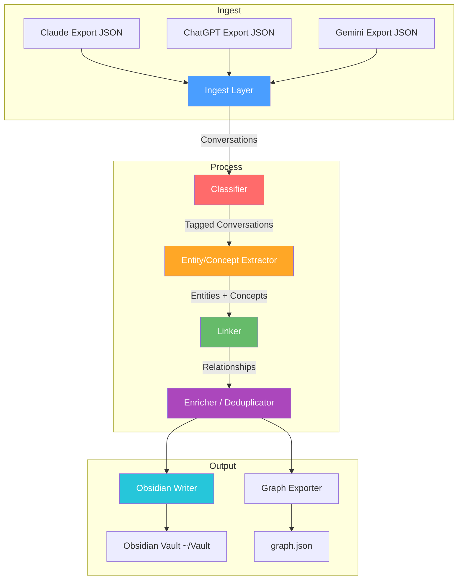
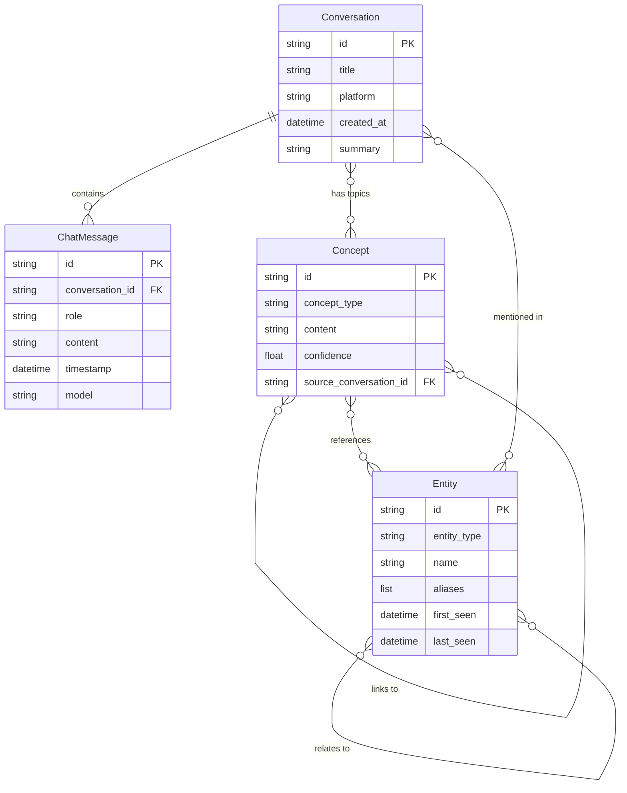

# Digital Brain Pipeline

A Palantir Foundry ontology-inspired system for processing AI chat exports (Claude, ChatGPT, Gemini) into a structured knowledge graph that outputs to an Obsidian vault.

Inspired by [Karpathy's Wiki approach](https://x.com/karpathy): ingest → classify → extract entities/concepts → cross-link → output as interconnected Obsidian notes.

## Architecture



## Ontology Schema



## Pipeline Stages

| Stage | Module | Description |
|-------|--------|-------------|
| **1. Ingest** | `src/ingest/` | Platform-specific parsers for Claude, ChatGPT, and Gemini JSON exports |
| **2. Classify** | `src/process/classifier.py` | Assign topics to conversations via keyword matching |
| **3. Extract** | `src/process/extractor.py` | Pull entities (people, tools, projects) and concepts (decisions, action items, insights) from text |
| **4. Link** | `src/process/linker.py` | Build relationships between objects based on co-occurrence and shared topics |
| **5. Enrich** | `src/process/enricher.py` | Deduplicate entities, merge aliases, compute metadata |
| **6. Output** | `src/output/obsidian.py` | Generate Obsidian notes with YAML frontmatter, wikilinks, and Dataview fields |

## Project Structure

```
digital-brain-pipeline/
├── README.md
├── requirements.txt
├── config/
│   ├── schema.yaml          # Core ontology definitions
│   └── settings.yaml        # Runtime config (vault path, sources, etc.)
├── src/
│   ├── models/              # Pydantic data models (ontology)
│   │   ├── base.py          # OntologyObject, Platform enum
│   │   ├── message.py       # ChatMessage, Conversation
│   │   ├── entity.py        # Entity (Person/Org/Project/Tool/Location)
│   │   ├── concept.py       # Concept (Topic/Decision/ActionItem/Insight)
│   │   └── relationship.py  # Relationship links between objects
│   ├── ingest/              # Platform-specific parsers
│   │   ├── base.py          # Abstract BaseIngester
│   │   ├── claude.py        # Claude export parser
│   │   ├── chatgpt.py       # ChatGPT export parser
│   │   └── gemini.py        # Gemini export parser
│   ├── process/             # Processing pipeline stages
│   │   ├── classifier.py    # Topic classification
│   │   ├── extractor.py     # Entity/concept extraction
│   │   ├── linker.py        # Cross-referencing and linking
│   │   └── enricher.py      # Deduplication and metadata
│   ├── output/              # Output formatters
│   │   ├── obsidian.py      # Obsidian markdown generator
│   │   └── graph.py         # JSON graph exporter
│   └── pipeline.py          # Main orchestrator
├── tests/
│   ├── test_models.py
│   ├── test_ingest.py
│   ├── test_process.py
│   └── test_output.py
└── scripts/
    ├── run_pipeline.py      # CLI entry point
    └── export_helpers.py    # Export file scanner/detector
```

## Setup

```bash
# Clone
git clone https://github.com/DrTyson-code/digital-brain-pipeline.git
cd digital-brain-pipeline

# Create virtual environment
python3 -m venv .venv
source .venv/bin/activate

# Install dependencies
pip install -r requirements.txt

# Run tests
python -m pytest tests/ -v
```

## Usage

### 1. Export your AI chat data

- **Claude**: [claude.ai](https://claude.ai) → Settings → Account → Export Data
- **ChatGPT**: [chatgpt.com](https://chatgpt.com) → Settings → Data Controls → Export Data
- **Gemini**: [takeout.google.com](https://takeout.google.com) → Select "Gemini Apps"

### 2. Scan for export files

```bash
python scripts/export_helpers.py ~/Downloads
```

### 3. Run the pipeline

```bash
# Using config file
python scripts/run_pipeline.py --config config/settings.yaml

# Using direct source paths
python scripts/run_pipeline.py \
  --source claude:~/Downloads/claude-export/conversations.json \
  --source chatgpt:~/Downloads/conversations.json \
  --vault ~/Vault

# With graph export
python scripts/run_pipeline.py --config config/settings.yaml --graph
```

### 4. Check your vault

The pipeline creates notes organized into folders:

```
~/Vault/
├── AI-Conversations/    # One note per conversation
├── Contacts/            # People and organizations
├── Projects/            # Project entities
├── Tools/               # Technologies and tools
├── Concepts/            # Topics, insights, questions
├── Decisions/           # Decisions extracted from chats
└── Action-Items/        # Action items and TODOs
```

Each note includes:
- **YAML frontmatter** with tags, aliases, dates
- **Wikilinks** `[[like this]]` for cross-referencing
- **Dataview fields** for queryable metadata
- **Backlinks section** showing related objects

## Configuration

Edit `config/settings.yaml` to customize:

```yaml
vault:
  path: ~/Vault              # Your Obsidian vault location

ingest:
  sources:
    claude: ~/Downloads/claude-exports
    chatgpt: ~/Downloads/chatgpt-exports
  min_messages: 2             # Skip short conversations

processing:
  confidence_threshold: 0.5   # Minimum confidence for extractions
  deduplicate_entities: true   # Merge duplicate entities

output:
  obsidian:
    tag_prefix: "ai-brain"    # Tag prefix for generated notes
    dataview_fields: true      # Include Dataview-compatible fields
    link_style: "wikilink"     # Use [[wikilinks]]
```

## Extending

### Adding a new platform

1. Create `src/ingest/your_platform.py` extending `BaseIngester`
2. Implement `parse_export()` to return `list[Conversation]`
3. Register it in `src/pipeline.py` → `INGESTERS` dict

### Adding LLM-powered extraction

The current extractor uses regex patterns. To upgrade to LLM-based extraction:

1. Add your API client to `src/process/extractor.py`
2. Send conversation text with a structured extraction prompt
3. Parse the LLM response into `Entity` and `Concept` objects

## License

MIT
